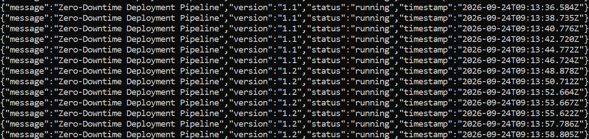

# Zero-Downtime Deployment Pipeline

A CI/CD pipeline that deploys a containerized Node.js app to AWS EC2 with **zero downtime**, using Terraform for infrastructure, Docker for packaging, GitHub Actions for automation, and an Nginx blue-green switch to eliminate the gap where a naive "stop old container, start new one" deploy would otherwise drop traffic.

## Why this project

Most simple deployment scripts do this on every push:

```
docker stop app && docker rm app && docker run -d ... app
```

Between `stop` and the new container becoming ready, the app is **down**. For a portfolio project demonstrating real deployment practices, that gap defeats the purpose. This project replaces that pattern with a blue-green switch: the new version is started, health-checked, and only then does traffic get routed to it — the old version keeps serving until the new one is proven healthy.

## Architecture

```
GitHub push (main branch)
        │
        ▼
GitHub Actions workflow
        │
        ├─► Build Docker image, push to Docker Hub
        │
        └─► SSH into EC2, run blue-green deploy:
                1. Read Nginx config → detect live port (3001 or 3002)
                2. Start new container on the OTHER port
                3. Health-check the new container (/health endpoint)
                4. If healthy: rewrite Nginx config → reload
                5. Stop and remove the old container
```

```
                        ┌────────────────────────┐
   Internet ──► :3000 ──►        Nginx            │
                        │   (reverse proxy)        │
                        └───────────┬─────────────┘
                                    │ proxies to whichever
                                    │ port is currently "live"
                        ┌───────────┴────────────┐
                        │                         │
                   app-blue:3001            app-green:3002
                   (one running at a time, the other only
                    exists briefly during a deploy)
```

## Tools used, and why

| Tool | Purpose | Why this one |
|---|---|---|
| **Terraform** | Provisions the EC2 instance, security group, key pair | Infrastructure as code — the whole environment is reproducible from `main.tf`, not built by hand in the console |
| **Docker** | Packages the Node.js app | Guarantees the app runs the same way locally, in CI, and on the server |
| **Docker Hub** | Stores the built image | Public, free registry GitHub Actions can push to and EC2 can pull from |
| **GitHub Actions** | Automates build + deploy on every push | No manual deploy steps; the pipeline is the single source of truth for how releases happen |
| **Nginx** | Reverse proxy that performs the blue-green switch | Lightweight, well-understood way to redirect traffic between two running versions without dropping requests |
| **AWS EC2 (t3.micro)** | Hosts the app | Free-tier-eligible compute; t3.micro was chosen after t2.micro repeatedly failed with `InsufficientInstanceCapacity` in this account's region |

## How the blue-green mechanism works

1. **Detection** — the deploy script checks the current `/etc/nginx/conf.d/app.conf` to see which port (3001 or 3002) Nginx is currently sending traffic to.
2. **Deploy to the idle port** — a new container, built from the latest pushed image, starts on whichever port is *not* currently live.
3. **Health check** — the script polls the new container's `/health` endpoint (up to 10 attempts, 3 seconds apart) before trusting it. If it never becomes healthy, the deploy aborts and the bad container is removed — the old version keeps serving, untouched.
4. **Switch** — only after a passing health check, Nginx's config is rewritten to point at the new port, `nginx -t` validates the syntax, and `systemctl reload nginx` applies it. Reload (not restart) means Nginx never stops accepting connections during the switch.
5. **Cleanup** — the previous container is stopped and removed, freeing that port for the *next* deploy.

This means every deploy alternates 3001 → 3002 → 3001 → 3002, and a broken build never reaches the public port.

## Verification

The clearest evidence of zero downtime: while a deploy was running in GitHub Actions, a local script hit the app every second and logged each response. The `version` field flips between builds with no dropped requests, no connection errors, and no gap in between.



## Screenshots

| Stage | Screenshot |
|---|---|
| Terraform provisions the EC2 instance | `screenshots/01-terraform-apply-success.png` |
| Instance confirmed running | `screenshots/02-terraform-ec2-provisioned.png` |
| Project structure | `screenshots/03-project-structure.png` |
| Docker container running on EC2 | `screenshots/04-docker-container-running.png` |
| Image pushed to Docker Hub | `screenshots/05-dockerhub-image-pushed.png` |
| Blue container running (`docker ps`) | `screenshots/06-docker-ps-app-blue.png` |
| Nginx proxying traffic correctly | `screenshots/07-nginx-proxy-live.png` |
| App reachable in browser | `screenshots/08-live-app-browser.png` |
| GitHub Actions run succeeds | `screenshots/09-github-action-success.png` |
| Full pipeline, all steps green | `screenshots/10-full-pipeline-success.png` |
| **Zero-downtime switch, verified live** | `screenshots/11-zero-downtime-verification.png` |

## How to reproduce

**Prerequisites:** AWS account, Docker Hub account, Terraform, AWS CLI configured with an IAM user (not root).

1. Clone the repo and set GitHub Secrets: `DOCKERHUB_USERNAME`, `DOCKERHUB_TOKEN`, `EC2_SSH_KEY`, `EC2_HOST`.
2. Provision infrastructure:
   ```
   cd terraform
   terraform apply
   ```
3. Note the output `instance_public_ip`, and update the `EC2_HOST` secret with it.
4. On the new instance, install Docker and Nginx, and create `/etc/nginx/conf.d/app.conf` (see `terraform/main.tf` and the workflow file for exact config).
5. Push to `main` — GitHub Actions builds the image and deploys it via the blue-green script automatically.
6. Visit `http://<instance-ip>:3000` to see the running app.

## Notes on running this cheaply

This project runs on a limited AWS free-credit account, so the EC2 instance is destroyed (`terraform destroy`) at the end of each working session to avoid unnecessary cost, and re-provisioned (`terraform apply`) at the start of the next one. Because nothing persists on a destroyed instance, Docker/Nginx setup is redone each session — this is a deliberate cost tradeoff, not a gap in the pipeline itself, which is fully automated once the base instance is configured.

## Lessons learned

- `t2.micro` repeatedly failed with `InsufficientInstanceCapacity` in this region; switching to `t3.micro` (and pinning the subnet to a single availability zone) resolved it.
- Amazon Linux requires `amazon-linux-extras install nginx1`, not a plain `yum install nginx`.
- Health-checking *before* switching traffic — not just before declaring success — is what actually makes a deploy zero-downtime, rather than just fast.
-
